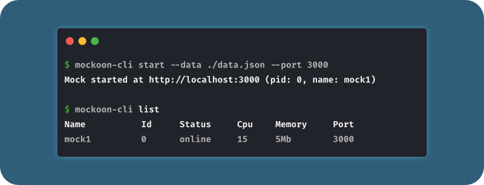

<div align="center">
  <a href="https://mockoon.com" alt="mockoon logo">
    
  </a>
  <br>
  <a href="https://mockoon.com/download/"></a>
  <a href="https://mockoon.com/"></a>
  <a href="http://eepurl.com/dskB2X"></a>
  <a href="https://twitter.com/GetMockoon"></a>
  <a href="https://discord.gg/MutRpsY5gE"></a>
  <br>
  <a href="https://www.npmjs.com/package/@mockoon/cli"></a>
  <br>
  <br>
  <h1>@Mockoon/cli</h1>
</div>

Welcome to Mockoon's official CLI, a lightweight and fast NPM package to deploy your mock APIs anywhere.
Feed it with a Mockoon's [export file](https://mockoon.com/docs/latest/import-export-data/), and you are good to go.

The CLI supports the same features as the main application: [templating system](https://mockoon.com/docs/latest/templating/overview/), [proxy mode](https://mockoon.com/docs/latest/proxy-mode/), [route response rules](https://mockoon.com/docs/latest/route-responses/dynamic-rules/), etc.



- [Installation](#installation)
- [Use your mocks in the CLI](#use-your-mocks-in-the-cli)
  - [Use a Mockoon environment file (preferred method)](#use-a-mockoon-environment-file-preferred-method)
  - [Use a Mockoon export file](#use-a-mockoon-export-file)
- [Compatibility](#compatibility)
- [Commands](#commands)
  - [`mockoon-cli start`](#mockoon-cli-start)
  - [`mockoon-cli list [ID]`](#mockoon-cli-list-id)
  - [`mockoon-cli stop [ID]`](#mockoon-cli-stop-id)
  - [`mockoon-cli dockerize`](#mockoon-cli-dockerize)
  - [`mockoon-cli help [COMMAND]`](#mockoon-cli-help-command)
- [Docker](#docker)
  - [Using the generic Docker image](#using-the-generic-docker-image)
  - [Using the `dockerize` command](#using-the-dockerize-command)
- [Logs](#logs)
- [PM2](#pm2)
- [Mockoon's documentation](#mockoons-documentation)
- [Sponsors](#sponsors)
- [Support/feedback](#supportfeedback)
- [Contributing](#contributing)
- [Roadmap](#roadmap)

## Installation

```sh-session
$ npm install -g @mockoon/cli
```

Usage:

```sh-session
$ mockoon-cli COMMAND
```

## Use your mocks in the CLI

The CLI currently supports only data files (exported or not) in Mockoon's format.
The CLI can import and migrate data from older versions of Mockoon. However, it doesn't alter the file you provide and only migrates a copy. If you created or exported your mock with a more recent version of the application, you need to update your CLI with the following command: `npm install -g @mockoon/cli`.

Two methods are available to run your mocks with the CLI: directly using a Mockoon's environment file or an export file.

### Use a Mockoon environment file (preferred method)

Following Mockoon's changes in version [1.16.0](https://github.com/mockoon/mockoon/releases/tag/v1.16.0) and starting with CLI [v1.2.0](https://github.com/mockoon/cli/releases/tag/v1.2.0), the latter is directly compatible with Mockoon's environment files, without the need to use the export method (see below).

You can run your mock in one single step using the [start command](#mockoon-cli-start) and replacing `~/path/to/your-environment-file.json` by the actual location of your Mockoon environment file:

```sh-sessions
$ mockoon-cli start --data ~/path/to/your-environment-file.json
```

> To locate your environment file from the main application, right-click on a environment and select "Show in folder" in the context menu.

### Use a Mockoon export file

While we recommend using the method above to launch your mocks with the CLI, you can still use Mockoon's export feature. The advantage of this method is that it allows exporting multiple mocks and run them together with one [start command](#mockoon-cli-start) and the `--all` flag.

To export your environment(s) to use them in the CLI, follow these steps:

1. Open the `Import/export` application menu and choose `Mockoon's format -> Export all environments to a file (JSON)` or `Mockoon's format -> Export current environment to a file (JSON)`.

   

   > You can also right-click on one of the environments and select `Copy to clipboard (JSON)`. You will then have to manually create a file and paste the environment's JSON data.

   

2. Choose a folder to save the JSON file.
3. Use the [start command](#mockoon-cli-start) below to launch your mock APIs with the CLI:

   ```sh-sessions
   $ mockoon-cli start --data ~/path/to/your-export-file.json -i 0
   ```

You will find more details in the [official documentation](https://mockoon.com/docs/latest/import-export-data/).

## Compatibility

Mockoon's CLI has been tested on Node.js versions 10, 12, 14, and 15.

## Commands

- [`mockoon-cli start`](#mockoon-cli-start)
- [`mockoon-cli list [ID]`](#mockoon-cli-list-id)
- [`mockoon-cli stop [ID]`](#mockoon-cli-stop-id)
- [`mockoon-cli dockerize`](#mockoon-cli-dockerize)
- [`mockoon-cli help [COMMAND]`](#mockoon-cli-help-command)

### `mockoon-cli start`

Starts a mock API from a Mockoon's environment file or export file. As an export file can contain multiple environments, you can indicate the one you want to run by specifying its index in the file or its name.
If only one environment is present in the file, you can omit the index, and the CLI will run it by default.

The process will be created by default with the name and port of the Mockoon's environment. You can override these values by using the `--port` and `--pname` flags.

Using the `--daemon-off` flag will keep the CLI in the foreground. The mock API process will not be [managed by PM2](#pm2). When running as a blocking process, all the logs are sent to both stdout (console) and the [usual files](logs).

```
USAGE
  $ mockoon-cli start

OPTIONS
  -a, --all               Run all environments
  -d, --data=data         [required] Path or URL to your Mockoon file
  -i, --index=index       Environment's index in the data file
  -n, --name=name         Environment name in the data file
  -N, --pname=pname       Override process name
  -p, --port=port         Override environment's port
  -l, --hostname=0.0.0.0  Override default listening hostname (0.0.0.0)
  -t, --log-transaction   Log the full HTTP transaction (request and response)
  -r, --repair            If the data file seems too old, or an invalid Mockoon file, migrate/repair without prompting
  -D, --daemon-off        Keep the CLI in the foreground and do not manage the process with PM2
  -h, --help              Show CLI help

EXAMPLES
  $ mockoon-cli start --data ~/data.json
  $ mockoon-cli start --data ~/data.json --index 0
  $ mockoon-cli start --data https://file-server/data.json --index 0
  $ mockoon-cli start --data ~/data.json --name "Mock environment"
  $ mockoon-cli start --data ~/data.json --name "Mock environment" --pname "proc1"
  $ mockoon-cli start --data ~/data.json --index 0 --daemon-off
  $ mockoon-cli start --data ~/data.json --index 0 --log-transaction
  $ mockoon-cli start --data ~/data.json --all
```

### `mockoon-cli list [ID]`

_Command alias: `info`_

Lists all the running mock APIs and display some information: process name, pid, status, cpu, memory, port.
You can also get the same information for a specific mock API by providing its pid or name.

```
USAGE
  $ mockoon-cli list

ARGUMENTS
  ID  Running API pid or name

OPTIONS
  -h, --help  show CLI help

EXAMPLE
  $ mockoon-cli list
  $ mockoon-cli info
  $ mockoon-cli list 0
  $ mockoon-cli list "Mock_environment"
```

### `mockoon-cli stop [ID]`

Stops one or more running processes. When 'all' is provided, all processes will be stopped.

```
USAGE
  $ mockoon-cli stop [ID]

ARGUMENTS
  ID  Running API pid or name

OPTIONS
  -h, --help  show CLI help

EXAMPLE
  $ mockoon-cli stop
  $ mockoon-cli stop 0
  $ mockoon-cli stop "name"
  $ mockoon-cli stop "all"
```

### `mockoon-cli dockerize`

Generates a Dockerfile used to build a self-contained image of a mock API. After building the image, no additional parameters will be needed when running the container.
This command takes similar flags as the [`start` command](#mockoon-start).

Please note that this command will extract your Mockoon environment from the file you provide and put it side by side with the generated Dockerfile. Both files are required in order to build the image.

For more information on how to build the image: [Using the dockerize command](#using-the-dockerize-command)

```
USAGE
  $ mockoon-cli dockerize

OPTIONS
  -d, --data=data         [required] Path or URL to your Mockoon file
  -i, --index=index       Environment's index in the data file
  -n, --name=name         Environment name in the data file
  -p, --port=port         Override environment's port
  -o, --output            [required] Generated Dockerfile path and name (e.g. `./Dockerfile`)
  -t, --log-transaction   Log the full HTTP transaction (request and response)
  -r, --repair            If the data file seems too old, or an invalid Mockoon file, migrate/repair without prompting
  -h, --help              Show CLI help

EXAMPLES
  $ mockoon-cli dockerize --data ~/data.json --output ./Dockerfile
  $ mockoon-cli dockerize --data ~/data.json --index 0 --output ./Dockerfile
  $ mockoon-cli dockerize --data https://file-server/data.json --index 0 --output ./Dockerfile
  $ mockoon-cli dockerize --data ~/data.json --name "Mock environment" --output ./Dockerfile
```

### `mockoon-cli help [COMMAND]`

Returns information about a command.

```
USAGE
  $ mockoon-cli help [COMMAND]

ARGUMENTS
  COMMAND  command to show help for

OPTIONS
  --all  see all commands in CLI
```

## Docker

### Using the generic Docker image

A generic Docker image is published on the [Docker Hub Mockoon CLI repository](https://hub.docker.com/r/mockoon/cli). It uses `node:14-alpine` and installs the latest version of Mockoon CLI.

All of `mockoon-cli start` flags (`--port`, `--index`, etc.) must be provided when running the container.

To load the Mockoon data, you can either mount a local data file and pass `mockoon-cli start` flags at the end of the command:

`docker run -d --mount type=bind,source=/home/your-data-file.json,target=/data,readonly -p 3000:3000 mockoon/cli:latest --data data --index 0 --port 3000`

Or directly pass a URL to the `mockoon-cli start` command, without mounting a local data file:

`docker run -d -p 3000:3000 mockoon/cli:latest -d https://raw.githubusercontent.com/mockoon/mock-samples/main/samples/generate-mock-data.json --index 0 --port 3000`

Mockoon CLI's logs will be sent to both stdout (console) and the [usual files](#logs).

### Using the `dockerize` command

You can use the [`dockerize` command](#mockoon-cli-dockerize) to generate a new Dockerfile that will allow you to build a self-contained image. Thus, no Mockoon CLI specific parameters will be needed when running the container. You can still provide arguments at runtime if needed (see the last example).

- Run the `dockerize` command:

  `mockoon-cli dockerize --data ./sample-data.json --port 3000 --index 0 --output ./tmp/Dockerfile`

- navigate to the `tmp` folder, where the Dockerfile has been generated:

  `cd tmp`

- Build the image:

  `docker build -t mockoon-mock1 .`

- Run the container:

  `docker run -d -p <host_port>:3000 mockoon-mock1`

- Or run the container with arguments:

  `docker run -d -p <host_port>:3000 mockoon-mock1 --log-transaction`

## Logs

Logs are located in `~/.mockoon-cli/logs/{mock-name}-[error|out].log`.

The `error.log` file contains mostly server errors that occur at startup time and prevent the mock API to run (port already in use, etc.). They shouldn't occur that often.

The `out.log` file contains all other log entries (all levels) produced by the running mock server. Most of the errors occurring in Mockoon CLI (or the main application) are not critical and therefore considered as normal output. As an example, if the JSON body from an entering request is erroneous, Mockoon will log a JSON parsing error, but it won't block the normal execution of the application.

When running the CLI with the [`--daemon-off` flag](#mockoon-cli-start), logs are sent to both stdout (console) and the above files.

## PM2

Mockoon CLI uses [PM2](https://pm2.keymetrics.io/) to start, stop or list the running mock APIs. Therefore, you can directly use PM2 commands to manage the processes.

## Mockoon's documentation

You will find Mockoon's [documentation](https://mockoon.com/docs/latest) on the official website. It covers the most complex features.

## Sponsors

If you like Mockoon, you can support the project with a one-time donation:
[](https://paypal.me/255kb) <a href="https://www.buymeacoffee.com/255kb" target="_blank"></a>

You can also [sponsor the maintainer (255kb) on GitHub](https://github.com/sponsors/255kb) and join all the [Sponsors and Backers](https://github.com/mockoon/mockoon/blob/main/backers.md) who helped this project over time!

## Support/feedback

You can discuss all things related to Mockoon's CLI, and ask for help, on the [official community](https://github.com/mockoon/cli/discussions). It's also a good place to discuss bugs and feature requests before opening an issue on this repository. For more chat-like discussions, you can also join our [Discord server](https://discord.gg/MutRpsY5gE).

## Contributing

If you are interested in contributing to Mockoon, please take a look at the [contributing guidelines](https://github.com/mockoon/cli/blob/main/CONTRIBUTING.md).

Please also take a look at our [Code of Conduct](https://github.com/mockoon/cli/blob/main/CODE_OF_CONDUCT.md).

## Roadmap

If you want to know what will be coming in the next release you can check the global [Roadmap](https://github.com/orgs/mockoon/projects/2).

New releases will be announced on Mockoon's [Twitter account @GetMockoon](https://twitter.com/GetMockoon) and through the newsletter to which you can subscribe [here](http://eepurl.com/dskB2X).
